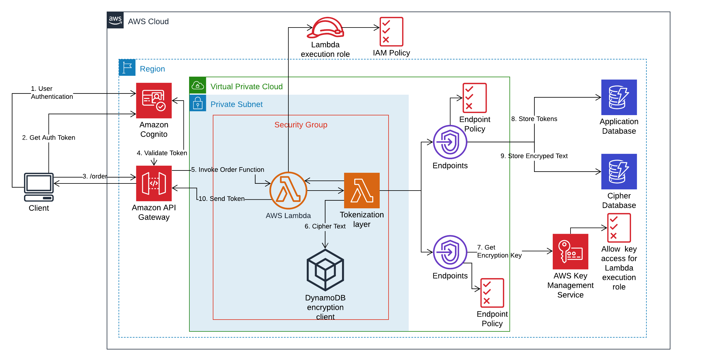

# Tokenization and Encryption of Sensitive Data

Data Masking solution that ingests data and identifies PII/PCI data and returns masked data back to reduce the exposure of sensitive information, using Serverless Tokenization, SAM and Lambda Layers.

Please refer to [Building a **serverless tokenization solution** to **mask sensitive data**](https://aws.amazon.com/blogs/compute/building-a-serverless-tokenization-solution-to-mask-sensitive-data/), for more info.
 
## Architecture



* [x] Serverless Tokenization
* [ ] [Maskopy Solution to Copy and Obfuscate Production Data to Target Environments in AWS](https://github.com/FINRAOS/maskopy)
 
## Prerequisites 
 
1. [ ] [AWS Account](https://aws.amazon.com/free)
2. [ ] [AWS Cloud9-IDE](https://docs.aws.amazon.com/cloud9/latest/user-guide/tutorial-create-environment.html) for writing, running and debugging code on the cloud: `./cloud9.sh`

```
git clone https://github.com/nnthanh101/serverless-tokenization
cd serverless-tokenization

./deploy.sh
```

## Step 1: Create Customer Managed KMS Key `KMS-Key`

* [x] 1.1. Build the SAM template (template.yaml)
  `sam build --use-container`
* [x] 1.2. Package the code and push to S3 Bucket. 
  `sam package --s3-bucket ${S3_BUCKET} --output-template-file packaged.yaml`
* [x] 1.3. Packaged.yaml (created in the above step) will be used to deploy the code and resources to AWS. 
  `sam deploy --template-file ./packaged.yaml --stack-name kms-stack --capabilities CAPABILITY_IAM`
* [x] Get the output variables of the stack 
  `aws cloudformation describe-stacks --stack-name ${STACK_NAME}`

Once done, the output will look like

```json
"Outputs": [
                {
                    "Description": "ARN for KMS-CMK Key created", 
                    "OutputKey": "KMSKeyID", 
                    "OutputValue": "*********"
                }
            ]
```

Note the *OutputValue* of  *OutputKey* `KMSKeyID` from the output for later steps.

The CloudFormation stack created Customer Managed KMS key and gave permissions to the root user to access the key. This master encryption key will be used to generate data encryption keys for encrypting items later in the module. 

## Step 2. Create Lambda Layer for String Tokenization & Encrypted Data Store

* [x] **Lambda Layers** provides a mechanism to externally package dependencies that can be shared across multiple Lambda functions. 

* [ ] SAM local development

```
# export SAM_PROJECT=tokenizer
export SAM_PROJECT=M2M-App

sam init                  \
    --name ${SAM_PROJECT} \
    --package-type Zip    \
    --runtime python3.7   \
    --app-template hello-world 
```

* **Step 2.1** Run the script to compile and install the dependent libraries in *dynamodb-client/python/* directory. 
For Lambda Function, we can use `sam build --use container`; but for **Lambda Layer**, we need to download the Lambda docker image to compile dependent libraries for Amazon Linux Image. [More details on this](https://github.com/pyca/cryptography/issues/3051?source=post_page-----f3e228470659----------------------)
  ```
  ./get_AMI_packages_cryptography.sh
  ```

* **Step 2.2** Build the SAM template (template.yaml)
  ```
  sam build --use-container
  ```

* **Step 2.3** Copy the python files `ddb_encrypt_item.py` and `hash_gen.py` to *dynamodb-client/python/*. This is required since Lambda Layer expects files to be in a specific directory to be used by Lambda function. [More details on this](https://docs.aws.amazon.com/lambda/latest/dg/configuration-layers.html#configuration-layers-path)

  ```
  cp ddb_encrypt_item.py dynamodb-client/python/
  cp hash_gen.py dynamodb-client/python/
  ```

  `ddb_encrypt_item.py` – This file contains the logic to encrypt and decrypt the plain text and store encrypted information in DynamoDB table.

  `hash_gen.py` - This file contains the logic to create UUID tokens for strings which will be provided to the end application in exchange for sensitive data, for example, credit card. 

* **Step 2.4** Package the code and push to S3 Bucket. Replace `unique-s3-bucket-name` with the value identified in Step 2

  ```bash
  sam package --s3-bucket ${S3_BUCKET} --output-template-file packaged.yaml
  ```

* **Step 2.5** Deploy SAM (CloudFormation stack) using the below code to create resources and deploy your code. Wait for the stack creation to complete. 

  ```bash
  export STACK_NAME2=Tokenizer
  
  sam deploy --stack-name ${STACK_NAME2}                \
           --template-file ./packaged.yaml              \
           --region ${AWS_REGION} --confirm-changeset --no-fail-on-empty-changeset \
           --capabilities CAPABILITY_IAM                \
           --s3-bucket ${S3_BUCKET} --s3-prefix backend \
           --config-file samconfig.toml                 \
           --no-confirm-changeset                       \
           --tags                                       \
              Project=${PROJECT_ID}
  ```

**Step 5.8** Get the output variables of the stack

  ```bash
  aws cloudformation describe-stacks --stack-name tokenizer-stack
  ```

The output will look like 

```
------------------------------------------------------------
Outputs
------------------------------------------------------------
Key                 LayerVersionArn
Description         ARN for the published Layer version
Value         arn:aws:lambda:ap-southeast-1:701571471198:layer:TokenizeData:1    

Key           DynamoDBArn   
Description   ARN for DynamoDB Table
Value         arn:aws:dynamodb:ap-southeast-1:701571471198:table/CreditCardTokenizerTable                                       
------------------------------------------------------------
```

Note the *OutputValue* of `LayerVersionArn` and `DynamoDBArn` from the output for later steps.

Here, in **Step 2.5**, the CloudFormation stack created DynamoDB table to store encrypted data as well as Lamda Layer for encrypting/decrypting the sensitive data and generating unique tokens for sensitive data.

## Step 3: Create Serverless Application